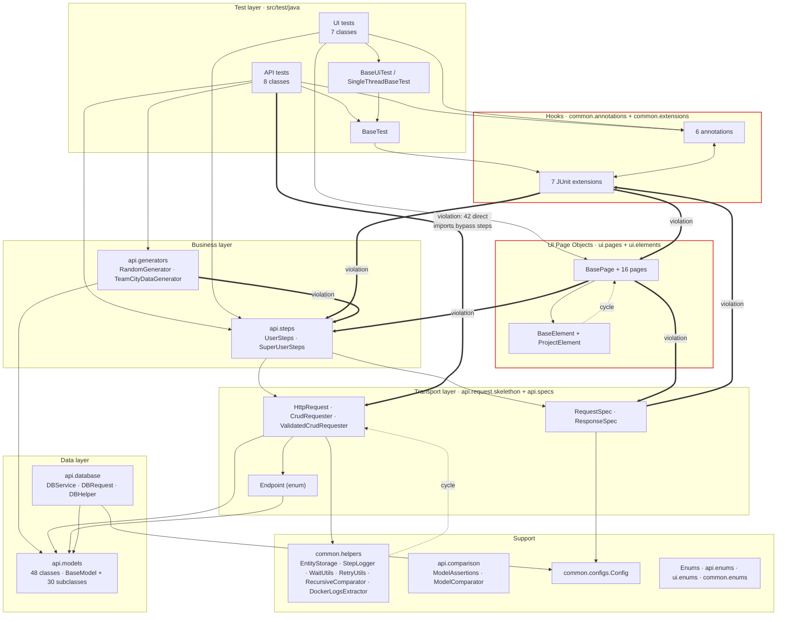
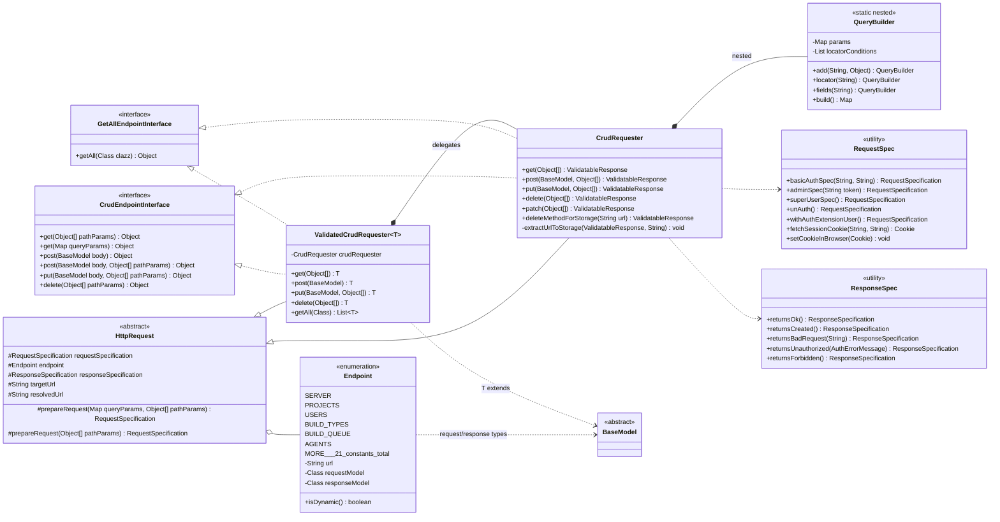
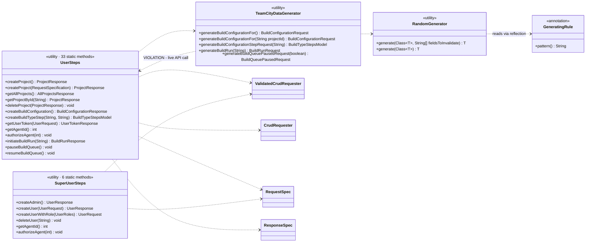
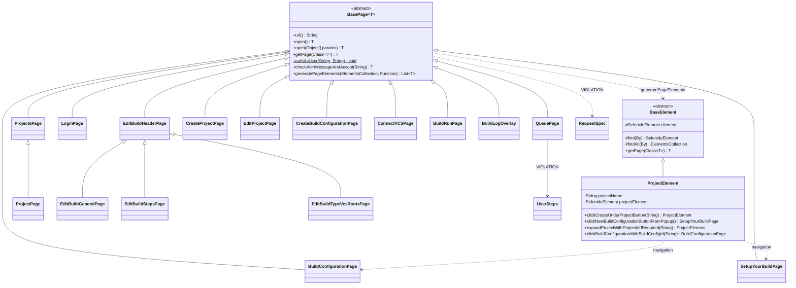

# Architecture — UML Diagrams & Coupling Analysis

Scope: all 142 Java classes in `src/` (124 in `src/main/java`, 18 in `src/test/java`).
Diagrams are Mermaid — they render in GitHub, IntelliJ (with the Mermaid plugin) and VS Code.

Everything below was derived from the real `import` graph, not from intent. The extraction rule:
per file, take every `import (api|ui|common|base).*`, resolve it to the longest matching declared
package, and count the edge. Enums, models and other pure data types are folded into their layer.

---

## 1. Layer map (component view)



Thick `violation` edges are dependencies that point the wrong way through the stack. They are
enumerated with evidence in §5.

---

## 2. UML — API transport core

This is the strongest part of the design: a small, generic, closed core.



**Why this works.** `HttpRequest` knows nothing about any specific entity. `Endpoint` is the single
place where URL ↔ request model ↔ response model are bound, so adding a TeamCity resource means
adding one enum constant, not a new class. `ValidatedCrudRequester` composes `CrudRequester` rather
than subclassing its behaviour, so the raw-response and typed-response paths cannot drift.

---

## 3. UML — Data / model layer

```mermaid
classDiagram
    direction TB

    class BaseModel {
        <<abstract>>
    }

    class ProjectRequest {
        +String id
        +String name
        +ParentProject parentProject
    }
    class ProjectResponse {
        +String id
        +String name
        +String href
        +BuildTypesContainer buildTypes
        +ProjectsContainer projects
        +ParametersContainer parameters
    }
    class BuildConfigurationRequest
    class BuildConfigurationResponse
    class BuildTypeStepsModel
    class BuildTypeStepsList
    class BuildRunRequest
    class BuildRunResponse
    class UserRequest
    class UserResponse
    class Agent
    class GetAgentsResponse
    class UserTokenRequest
    class UserTokenResponse
    class ServerInfoResponse

    BaseModel <|-- ProjectRequest
    BaseModel <|-- ProjectResponse
    BaseModel <|-- BuildConfigurationRequest
    BaseModel <|-- BuildConfigurationResponse
    BaseModel <|-- BuildTypeStepsModel
    BaseModel <|-- BuildTypeStepsList
    BaseModel <|-- BuildRunRequest
    BaseModel <|-- BuildRunResponse
    BaseModel <|-- UserRequest
    BaseModel <|-- UserResponse
    BaseModel <|-- Agent
    BaseModel <|-- GetAgentsResponse
    BaseModel <|-- UserTokenRequest
    BaseModel <|-- UserTokenResponse
    BaseModel <|-- ServerInfoResponse

    ProjectResponse *-- BuildTypesContainer
    ProjectResponse *-- ProjectsContainer
    ProjectResponse *-- ParametersContainer
    ProjectRequest *-- ParentProject
    ParametersContainer *-- PropertyItem
    UserResponse *-- RolesContainer
    UserResponse *-- GroupsContainer
    UserResponse *-- PropertiesContainer
    RolesContainer *-- Role
    GroupsContainer *-- Group
    PropertiesContainer *-- Property
    BuildTypeStepsList *-- BuildTypeStepsModel
    BuildTypeStepsModel *-- StepProperties
    BuildRunResponse *-- TriggeredInfo
    BuildCancelResponse *-- CanceledInfo
    Agent *-- AuthorizedInfo
    Agent *-- EnabledInfo
```



48 classes: `BaseModel` plus 30 subclasses plus 17 that extend nothing. The 17 (`PropertyItem`,
`ParentProject`, `Group`, `StepProperties`, `TriggeredInfo`, `CanceledInfo`, …) are nested value
objects that are never sent as a top-level body — a defensible distinction, though it is not documented anywhere and reads as an
oversight. `BaseModel` itself is empty; it exists purely as a type bound for
`ValidatedCrudRequester<T extends BaseModel>` and as a parameter type on `CrudEndpointInterface`.

---

## 4. UML — Business, UI and test layers

### 4.1 Steps and generators



### 4.2 UI page objects



The self-typed `BasePage<T extends BasePage>` gives fluent chaining without casts in subclasses, and
`EditBuildHeaderPage` correctly factors the shared build-edit header into an intermediate class.
`ProjectElement` is the only element abstraction — 16 pages sharing 2 element classes means most
locator logic still lives directly in the pages.

### 4.3 Test hierarchy and JUnit hooks

```mermaid
classDiagram
    direction TB

    class BaseTest {
        #SoftAssertions softly
        +setupAgent()$ void
        +beforeEach() void
        +afterEach() void
    }
    class BaseUiTest {
        +setupSelenoid()$ void
        +tearDown() void
    }
    class SingleThreadBaseTest {
        <<Execution SAME_THREAD>>
    }

    BaseTest <|-- BaseUiTest
    BaseUiTest <|-- SingleThreadBaseTest

    class ConfigStepsTest
    class AgentTest
    class AuthorizationUserTest
    class ApiBuildConfigurationTest
    class DeleteProjectTest
    class GetProjectTest
    class PostProjectTest
    class ApiRegularBuildRunTest
    class LoginTest
    class AuthenticationTest
    class UsersEnterWithoutLoginTest
    class UiBuildConfigurationTest
    class CreateProjectTest
    class UiRegularBuildRunTest

    BaseTest <|-- ConfigStepsTest
    BaseTest <|-- AgentTest
    BaseTest <|-- AuthorizationUserTest
    BaseTest <|-- ApiBuildConfigurationTest
    BaseTest <|-- DeleteProjectTest
    BaseTest <|-- GetProjectTest
    BaseTest <|-- PostProjectTest
    SingleThreadBaseTest <|-- ApiRegularBuildRunTest : VIOLATION - API test on UI base
    BaseUiTest <|-- LoginTest
    BaseUiTest <|-- AuthenticationTest
    BaseUiTest <|-- UsersEnterWithoutLoginTest
    BaseUiTest <|-- UiBuildConfigurationTest
    BaseUiTest <|-- CreateProjectTest
    SingleThreadBaseTest <|-- UiRegularBuildRunTest

    class AuthUser {
        <<annotation>>
    }
    class PauseBuildQueue {
        <<annotation>>
    }
    class ResumeBuildQueueAfterTest {
        <<annotation>>
    }
    class InititateBuildRun {
        <<annotation>>
    }
    class AuthAgentAfterTest {
        <<annotation>>
    }
    class Browsers {
        <<annotation>>
    }

    class AuthUserExtension {
        <<BeforeEach, AfterEach>>
        +getAuthUserToken()$ UserTokenResponse
    }
    class PauseBuildQueueExtension {
        <<BeforeEach>>
    }
    class ResumeBuildQueueAfterTestExtension {
        <<AfterEach>>
    }
    class InitiateBuildRunExtension {
        <<BeforeEach>>
    }
    class AuthAgentAfterTestExtension {
        <<AfterEach>>
    }
    class BrowserMatchExtension {
        <<ExecutionCondition>>
    }
    class TimingExtension {
        <<Before/AfterTestExecution>>
    }

    AuthUser ..> AuthUserExtension : ExtendWith
    PauseBuildQueue ..> PauseBuildQueueExtension : ExtendWith
    ResumeBuildQueueAfterTest ..> ResumeBuildQueueAfterTestExtension : ExtendWith
    InititateBuildRun ..> InitiateBuildRunExtension : ExtendWith
    AuthAgentAfterTest ..> AuthAgentAfterTestExtension : ExtendWith
    Browsers ..> BrowserMatchExtension : ExtendWith
    BaseTest ..> AuthUserExtension : ExtendWith
    BaseTest ..> TimingExtension : ExtendWith
    BaseTest ..> EntityStorage : init/clear
    BaseUiTest ..> Config
    AuthUserExtension ..> UserSteps
    AuthUserExtension ..> SuperUserSteps
    AuthUserExtension ..> BasePage : VIOLATION
    InitiateBuildRunExtension ..> UserSteps
    PauseBuildQueueExtension ..> UserSteps
    ResumeBuildQueueAfterTestExtension ..> UserSteps
    AuthAgentAfterTestExtension ..> UserSteps
```



The meta-annotation pattern (`@AuthUser` → `@ExtendWith(AuthUserExtension.class)`) is the right call:
tests declare intent, extensions own the mechanics, and the annotation↔extension pair is a
JUnit-mandated cycle, not a design flaw. `EntityStorage` + `CrudRequester.extractUrlToStorage`
give automatic cleanup of everything created via POST — genuinely good, and the reason API tests
have no manual teardown.

---

## 5. Coupling analysis

### 5.1 Metrics by layer

Ce = outgoing dependencies (efferent), Ca = incoming (afferent), I = Ce / (Ce + Ca).
I ≈ 0 means stable/depended-upon; I ≈ 1 means volatile/depends-on-others.
Healthy layering = I decreasing as you go down the stack.

| Layer | Ce | Ca | I | Verdict |
| --- | ---: | ---: | ---: | --- |
| Tests (`src/test`) | 176 | 0 | 1.00 | ✅ correct — nothing depends on tests |
| `api.steps` | 40 | 22 | 0.65 | ⚠️ high Ce; also depended on by hooks and pages |
| `ui.pages` + `ui.elements` | 21 | 12 | 0.64 | ⚠️ should be ~0.3; leaks into the API stack |
| Hooks (annotations + extensions) | 15 | 21 | 0.42 | ⚠️ sits above and below other layers |
| `api.request` + `api.specs` | 23 | 56 | 0.29 | ✅ |
| `api.generators` | 5 | 25 | 0.17 | ✅ apart from the steps call-back |
| `common.helpers` | 3 | 13 | 0.19 | ⚠️ 3 outgoing edges are all into `api.*` |
| `api.models` | 11 | 60 | 0.15 | ✅ |
| Enums | 0 | 70 | 0.00 | ✅ perfectly stable |
| `common.configs` | 0 | 12 | 0.00 | ✅ |
| `api.comparison` | 0 | 5 | 0.00 | ✅ |
| `api.database` | 2 | 0 | 1.00 | ⚠️ dead code — zero inbound references |

The overall shape is right: the bottom of the stack (enums, config, models) has I = 0 and the top
(tests) has I = 1. The problems are all in the middle band.

### 5.2 Dependency cycles (package level)

| Cycle | Cause | Severity |
| --- | --- | --- |
| `api.generators` ↔ `api.steps` | `TeamCityDataGenerator.generateBuildConfigurationFor()` calls `UserSteps.createProject()` — a "generator" performs a live HTTP POST | **High** |
| `api.specs` ↔ `common.helpers` | `RequestSpec` uses `DockerLogsExtractor`; `EntityStorage` uses `RequestSpec` | **Medium** |
| `api.request.skelethon.requester` ↔ `common.helpers` | `CrudRequester` uses `StepLogger`/`EntityStorage`; `EntityStorage` uses `CrudRequester` | **Medium** |
| `ui.pages` ↔ `ui.elements` | `BasePage.generatePageElements()` returns `BaseElement`; `BaseElement.getPage()` returns `BasePage` | **Low** — mutual by design, but formalise it |
| `api.generators` ↔ `api.models.*` | Models carry `@GeneratingRule`; generators construct models | **Low** — annotation-only, acceptable |
| `common.annotations` ↔ `common.extensions` | `@ExtendWith` on the annotation | **None** — required by JUnit 5 |

### 5.3 Layering violations, with evidence

| # | Violation | Evidence | Why it matters |
| --- | --- | --- | --- |
| 1 | **Tests bypass the steps layer** — 42 direct imports of `api.request.*` / `api.specs` from test classes vs 13 imports of `api.steps` | all 8 API test classes + 3 UI test classes | The steps layer is supposed to be the single business-facing API. With a 3:1 bypass ratio it is an optional convenience, so an endpoint change ripples into test bodies instead of stopping at `UserSteps`. |
| 2 | **API test extends UI base class** | `src/test/java/api/buildRun/RegularBuildRunTest.java:25` → `extends SingleThreadBaseTest` | Pulls Selenide config, remote browser setup and `Selenide.closeWebDriver()` into a pure API test. It only wants `@Execution(SAME_THREAD)`. |
| 3 | **Page object calls API steps** | `ui/pages/QueuePage.java:3` → `import api.steps.UserSteps` | A page object should describe a screen. Mixing HTTP calls into it means UI failures and API failures surface from the same class. |
| 4 | **Page object calls the API spec layer** | `ui/pages/BasePage.java:34` → `RequestSpec.setCookieInBrowser(RequestSpec.fetchSessionCookie(...))` | Session-cookie login is a test-setup concern, not a base-page concern; it puts `RequestSpec` on the dependency path of all 17 pages. |
| 5 | **API spec layer calls a JUnit extension** | `api/specs/RequestSpec.java:93` → `AuthUserExtension.getAuthUserToken()` | Reverses the stack completely: transport → test-lifecycle. `RequestSpec` can no longer be used outside a JUnit run, and it closes the loop `extensions → steps → specs → extensions`. |
| 6 | **Generator performs a live API call** | `api/generators/TeamCityDataGenerator.java:15` → `UserSteps.createProject()` | Callers cannot tell which "generate" methods are pure and which hit the server. Makes generators unusable for negative/offline cases. |
| 7 | **Extension depends on UI page objects** | `common/extensions/AuthUserExtension.java` → `import ui.pages.BasePage` | One extension now couples the API hook path to Selenide. |
| 8 | **UI enums live under `api.enums`** | `api/enums/buildconfiguration/BuildConfigDropdown`, `BuildConfigTypeDropdown` — literal dropdown labels ("From template", "Regular") used only by `ui.pages` | Package name misrepresents ownership; 2 of the 16 UI→enum edges cross into the API tree for no reason. |
| 9 | **`api.database` is unreferenced** | `DBService`, `DBRequest`, `DBHelper`, `Condition` — Ca = 0 | ~4 classes and a jOOQ/HikariCP dependency surface carried for nothing. Either wire it into verification or delete it. |
| 10 | **Duplicate simple names across layers** | `api.build.BuildConfigurationTest` vs `ui.buildconfiguration.BuildConfigurationTest`; `api.buildRun.RegularBuildRunTest` vs `ui.buildRun.RegularBuildRunTest` | Ambiguous in reports, stack traces and IDE navigation. |
| 11 | **`nk_Test_Ideas` in `src/test/java/ui`** | untracked scratch file, non-conventional name, no base class | Scratch work sitting in the compiled test source root. |

---

## 6. Verdict

**What is genuinely well-layered.** The API transport core is the strongest piece: `HttpRequest` →
`CrudRequester`/`ValidatedCrudRequester` behind two narrow interfaces, with `Endpoint` as the single
binding point for URL and models — new endpoints cost one enum constant. Models, enums and config
are perfectly stable (I = 0.00) and depend on nothing. `EntityStorage`-driven auto-cleanup and the
annotation→extension hook pattern are both well factored. Tests have Ca = 0, so nothing depends
upward.

**Where low coupling is not achieved.** Three specific places:

1. **The steps layer is not a boundary, it is a shortcut.** Tests reach past it into transport 42
   times. Until that ratio inverts, the layer provides no isolation.
2. **The middle band is knotted.** Four real cycles (`generators↔steps`, `specs↔helpers`,
   `requester↔helpers`, plus the annotation-level ones) mean `api.steps` (I = 0.65) and `ui.pages`
   (I = 0.64) are both volatile and depended-upon — the worst quadrant to be in.
3. **API and UI are not separated.** `RegularBuildRunTest` inherits Selenide setup it does not use,
   `QueuePage`/`BasePage` reach into API steps and specs, `AuthUserExtension` reaches into
   `ui.pages`, and UI dropdown enums live under `api.enums`. There is no single edge that separates
   the two stacks.

**Ranked fixes** (each is small and independently mergeable):

| Priority | Fix | Effort |
| --- | --- | --- |
| 1 | Break `RequestSpec` → `AuthUserExtension`: have the extension push the token into a `ThreadLocal` holder in `common.helpers` that `RequestSpec` reads | ~1h |
| 2 | Split `TeamCityDataGenerator`: pure builders stay; anything that creates server-side state moves to `UserSteps` | ~2h |
| 3 | Move `authAsUser` off `BasePage` into a `LoginSteps`/`ui.base` helper; drop `UserSteps` from `QueuePage` | ~2h |
| 4 | Introduce `SingleThreadApiTest extends BaseTest` and re-parent `api.buildRun.RegularBuildRunTest` | ~15min |
| 5 | Move `EntityStorage`'s cleanup HTTP call behind a small interface so `common.helpers` stops importing `api.*` | ~1h |
| 6 | Move `api.enums.buildconfiguration.*` → `ui.enums.buildconfiguration` | ~15min |
| 7 | Route test bodies through `UserSteps`; add steps methods where they are missing | incremental |
| 8 | Delete `api.database` (and its jOOQ/Hikari deps) or wire it into assertions | ~30min |
| 9 | Rename the duplicated test classes; move or delete `nk_Test_Ideas` | ~15min |

Fixes 1–6 remove every cycle except the two harmless ones (JUnit's annotation↔extension and the
`pages↔elements` pair) and take the API and UI stacks fully apart. Fix 7 is the one that actually
turns `api.steps` into a boundary, and it is the only item that cannot be done in a single sitting.

---

## 7. How to regenerate this analysis

```bash
# package-level dependency edges
for f in $(find src -name "*.java"); do
  pkg=$(grep -m1 "^package" $f | sed 's/package //;s/;//')
  grep -E "^import (api|ui|common)\." $f | sed 's/^import //;s/;//' \
    | sed 's/\.[A-Z][A-Za-z0-9_]*$//' | while read imp; do echo "$pkg -> $imp"; done
done | sort | uniq -c | sort -rn

# inheritance graph
grep -rhE "^(public |abstract |final )*(class|interface|enum|@interface) " src --include=*.java -H
```

Ce/Ca/I and the cycle list come from the same edge set, grouped by the layer mapping in §1.
